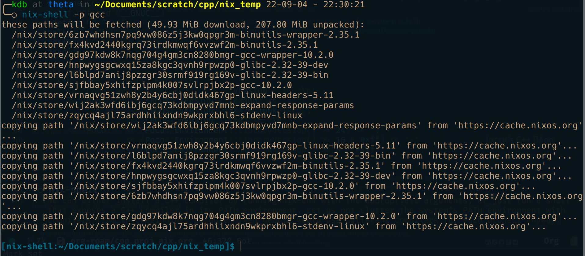
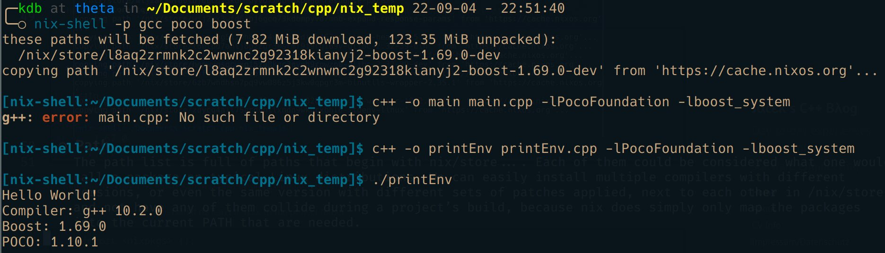

- <a href="#template-project-in-c-using-nix" id="toc-template-project-in-c-using-nix">Template Project in C++ using Nix</a>
  - <a href="#creating-a-c-project" id="toc-creating-a-c-project">Creating a C++ project</a>
  - <a href="#code" id="toc-code">Code</a>
  - <a href="#nix-shell" id="toc-nix-shell">nix-shell</a>
  - <a href="#path" id="toc-path">Path</a>
  - <a href="#run" id="toc-run">Run</a>
  - <a href="#default.nix" id="toc-default.nix">default.nix</a>

# Template Project in C++ using Nix

Taken from [this blog post](https://blog.galowicz.de/2019/04/17/tutorial_nix_cpp_setup/).

## Creating a C++ project

Create a sample C++ project with the following dependencies

- C++ compiler, of course. That might be GCC or Clang.
- Boost
- Poco

The program does nothing more than printing what compiler it was built with and which versions of boost and poco it is linked against.

## Code

``` cpp
#include <boost/lexical_cast.hpp>
#include <Poco/Environment.h>
#include <iostream>

#if defined(__clang__)
#define CC "clang++"
#elif defined (__GNUC__)
#define CC "g++"
#else
#define CC "<unknown compiler>"
#endif

int main() {
  std::cout << "Hello World!\n"
    << "Compiler: " << CC << " " << __VERSION__ << '\n'
    << "Boost: " << (BOOST_VERSION / 100000) << '.'
                 << (BOOST_VERSION / 100 % 1000) << '.'
                 << (BOOST_VERSION % 100) << '\n'
    << "POCO: " << (Poco::Environment::libraryVersion() >> 24) << '.'
                << (Poco::Environment::libraryVersion() >> 16 & 0xff) << '.'
                << (Poco::Environment::libraryVersion() >> 8 & 0xff)
                << '\n';
}
```

## nix-shell

We can either install a C++ compiler by running nix-env with the appropriate arguments, or just run a shell that exposes a C++ compiler in its PATH environment. Let us not clutter the system’s PATH environment with compilers from the beginning, because often people would use different compilers for each project anyway.



## Path

The path list is full of paths that begin with *nix/store*…. Each of them could be considered what one would call a package on typical Linux distributions. We can easily install multiple compilers with different versions, or even the same version with different sets of patches applied, next to each other in /nix/store and not have any of them collide during a project’s build, because nix does simply only map the packages into the current PATH that are needed.

## Run

To compile and run:

- `nix-shell -p gcc poco boost`
- `c++ -o printEnv printEnv.cpp -lPocoFoundation -lboost_system`
- ./printEnv



## default.nix

``` nix
with import <nixpkgs> {};

stdenv.mkDerivation {
  name = "my-app";
  src = ./.;

  buildInputs = [ boost poco ];

  buildPhase = "c++ -o printEnv printEnv.cpp -lPocoFoundation -lboost_system";

  installPhase = ''
    mkdir -p $out/bin
    cp printEnv $out/bin/
  '';
}
```

Then simply run `nix-build`.
